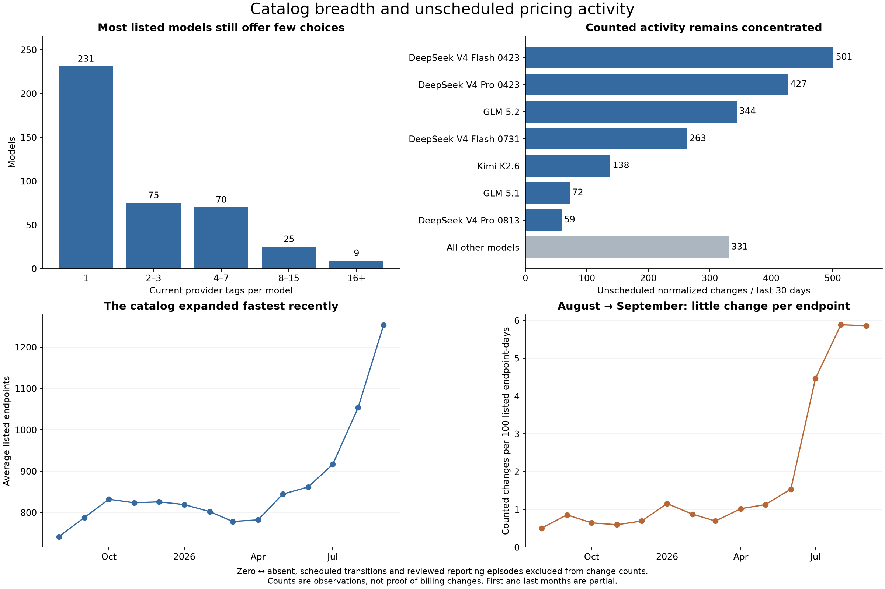

# Population and pricing activity

**After normalizing unmetered values and excluding schedules, recent activity is even more
concentrated in the discount battlers.** Provider breadth, price movement and model age are separate
dimensions; none alone predicts chart difficulty.

## Population

There are 410 currently listed models and 1,267 endpoints after excluding the two Lyria models for
their song-generation use case. The current user-choice count is 1,257 model/tag pairs. Of these models,
231 have one tag, 75 have two or three, 70 have four to seven, 25 have eight to fifteen, and nine have
sixteen or more. The median is one; the 95th percentile is ten; the maximum is 31.

The median upstream age is 259 days for currently listed models and 84 days for endpoints. These
measure different entities. Model age does not imply endpoint longevity or a mature provider market.
Historical first-observed ages are censored by the August 2025 start of collection.

## The last 30 days

The deep cohort has **2,135 counted changes across 210 of 1,434 endpoints observed during the window**.
342 of 410 currently listed models have no counted change in their endpoint histories during that
window. This does not claim uninterrupted listing or complete observation between scans.

| Model                  | Current tags | Historical tags | Counted changes / 30d |
| ---------------------- | -----------: | --------------: | --------------------: |
| DeepSeek V4 Flash 0423 |           15 |              29 |                   501 |
| DeepSeek V4 Pro 0423   |           15 |              23 |                   427 |
| GLM 5.2                |           31 |              48 |                   344 |
| DeepSeek V4 Flash 0731 |           28 |              34 |                   263 |
| Kimi K2.6              |           20 |              28 |                   138 |
| GLM 5.3                |           28 |              28 |                    28 |
| MiniMax M3             |           12 |              14 |                     5 |
| Claude Opus 4.8        |           11 |              12 |                     0 |

The five busiest models account for 1,673/2,135 (78.4%) of changes. GLM 5.3 is already broad but much
less active than GLM 5.2. We should not infer chaos from provider count or tune the product only to
one model's current behavior.

## Provider behavior is contextual

Baidu accounts for 761 changes and StreamLake for 623: **64.8% combined**. Nine of Baidu's eleven
recently observed endpoints change, versus eleven of StreamLake's twenty-eight. Novita contributes
113 changes, but only six of its 79 recently observed endpoints change. An organization-wide label
would obscure how concentrated its behavior is by model.

Anthropic, BaseTen, CoreWeave, Minimax, Z.AI and xAI have no counted changes in this recent cohort.
This is a windowed observation, not a permanent strategy classification. GMICloud contributes 141
changes and includes investigated rapid discount reversals, still counted because a reversal alone
does not prove an upstream mistake. [Reporting and anomalies](reporting.md) preserves that distinction.

Of 2,071 positive-to-positive prompt movements, 1,689 (81.6%) coincide with a discount change. That
is co-occurrence, not reconstructed causation. 265 moves are below 1%, 876 are between 1% and 10%,
and 930 are at least 10%. The busiest histories are not simply tiny meaningless adjustments.

## More observations do not always mean greater activity per endpoint

| Period                      | Average listed endpoints | Counted changes/day | Per 100 listed endpoint-days |
| --------------------------- | -----------------------: | ------------------: | ---------------------------: |
| Jun 2026                    |                      862 |                13.2 |                         1.54 |
| Jul                         |                      916 |                40.9 |                         4.46 |
| Aug                         |                    1,054 |                62.0 |                         5.88 |
| Sep, partial through export |                    1,253 |                73.4 |                         5.86 |

Daily volume rises again in September, but the exposure-adjusted rate is almost unchanged from
August. Catalog growth can explain higher totals without another acceleration per listed endpoint.
The July/August increase survives normalization. Earlier months fluctuate rather than rising steadily.
Scan coverage and unresolved reporting episodes limit interpretation of these observational rates.

## Schedule handling changes the meaning of the totals

Eight endpoint histories expose a `utc_*` override; six are currently listed. The first retained
scheduled observation is August 16, 2026. The classifier excludes **350 continuous observations**
involving scheduled states, all within the recent window. This includes 343 effective meter changes
and seven other observations. Initial/relisted records are already excluded independently.

The policy recognizes schedule presence only. It neither parses patterns nor chooses a base band.
Scheduled prices remain in the observed-state data and charts, while their movement does not inflate
activity, co-movement or temporal-detail statistics. Undeclared recurrence is not automatically a
schedule; the API must supply the `utc_*` condition for this rule to apply.

Sources: [models](data/models.csv), [endpoints](data/endpoints.csv), [organizations](data/organizations.csv),
[monthly exposure](data/monthly.csv), [classified observations](data/events.csv). See [methods](methods.md)
for the exact definition of “counted,” including the reviewed reporting exclusions.
