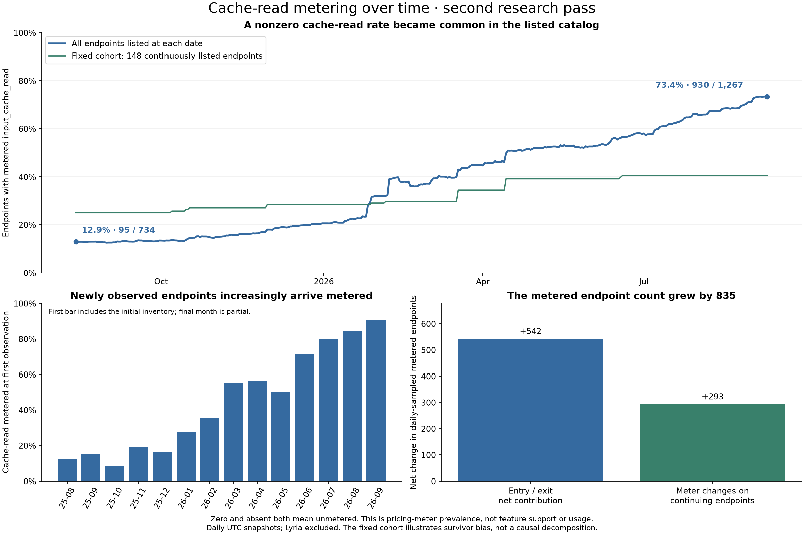
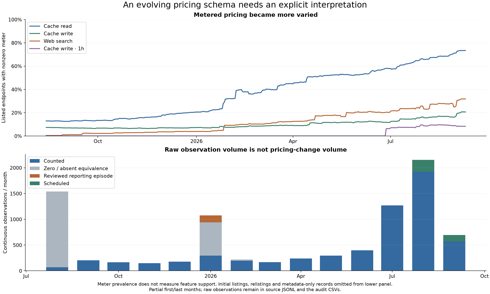

# Cache-read metering over time

**The share of listed endpoints exposing a nonzero `input_cache_read` rate increased from 12.9% to
73.4%.** This describes pricing-meter prevalence. It does not establish the share supporting caching,
the share of traffic cached, or customer savings. Zero and absent are both unmetered.

## The changing catalog

| Snapshot, UTC                   | Listed endpoints | Cache-read metered | Share |
| ------------------------------- | ---------------: | -----------------: | ----: |
| Aug 13, 2025, first observation |              734 |                 95 | 12.9% |
| Jan 1, 2026                     |              827 |                170 | 20.6% |
| Feb 1                           |              820 |                263 | 32.1% |
| Apr 1                           |              769 |                344 | 44.7% |
| Jul 1                           |              893 |                518 | 58.0% |
| Sep 8, export clock             |            1,267 |                930 | 73.4% |

The numerator grew by 835. The daily-sample bridge attributes a net **542** to entry/exit of metered
endpoints and **293** to meter-status changes on endpoints present at both adjacent samples.
Those are contributions to the endpoint count, not a decomposition of percentage-point change or
proof of causes. Intraday turnover is not separately resolved by this daily bridge.

New observations increasingly arrive with a cache-read rate: 15.0% of September 2025's 140 newly
observed endpoints, 55.2% of March 2026's 96, 80.2% of July's 237, and 84.5% of August's 387. The
partial September 2026 cohort is 90.5% (76/84). First observation does not prove launch date.

The **148 endpoints continuously listed for the entire collection period** went from 37 metered
(25.0%) to 60 (40.5%). Their slower increase shows why the changing catalog matters. This old survivor
cohort is not representative of all endpoints, and its trend should not replace the main curve.

Variant composition does not explain away the main result. Using the explicit `variant` property,
standard endpoints alone go from **92/661 (13.9%) to 867/1,173 (73.9%)**. Today's other variants are
76 batch endpoints (63 metered) and eighteen free endpoints (none metered). These are observed
variant labels, not labels inferred from meter values or provider-tag suffixes.

## Investigated jumps

Several visible jumps correspond to coordinated publication of nonzero cache rates with unchanged
prompt/completion, rather than more endpoints merely arriving:

| Observation, UTC | Organization | Endpoint observations | New cache/input ratio |
| ---------------- | ------------ | --------------------: | --------------------- |
| Jan 25, 21:50    | Fireworks    |                    15 | 0.5                   |
| Jan 27, 21:50    | AtlasCloud   |                    22 | 1.0                   |
| Feb 6, 21:50     | Chutes       |                    44 | 0.5                   |
| Mar 17, 18:50    | Mistral      |                    21 | 0.1                   |
| Apr 13, 22:50    | Parasail     |                    23 | Mixed                 |
| Jul 6, 15:50     | DigitalOcean |                    14 | Mixed                 |

January 25's daily increase is broader than Fireworks: 37 continuing endpoints become metered across
Fireworks, WandB, Google, Cerebras, Nebius and Z.AI. February 6 has 50 such additions over the full day,
44 of them in the Chutes batch. March 17's Mistral batch changes 21 cache rates, while the daily
bridge finds 20 continuing endpoints newly metered; a rate edit and a metering-status addition are
not necessarily the same event.

There is also a dip on February 12: 16 endpoints present at both daily samples lose nonzero cache
rates, across WandB (8), Google (6), and Nebius (2). The observation establishes metering changes,
not loss of caching support. The provenance is retained for any later upstream explanation.

## A cache rate is not automatically a discount

Of the 930 current metered cache-read endpoints, **22 charge the same reported rate as prompt**;
908 have a lower rate and none has a higher rate in this snapshot. The AtlasCloud introduction at a
1.0 ratio is a concrete historical example of why prevalence alone cannot measure economic benefit.
The most common current ratio is 0.1 (400/930), followed by 0.2 (124/930).

For future research, pairing prevalence with cache/input ratio distributions would answer a distinct
question: how the published relative cache rate changed. It would still not establish realized savings
without workload and cache-hit information.

## Other pricing conventions also expanded

Nonzero web-search rates grow from 3/734 (0.4%) at collection start to 402/1,267 (31.7%) now.
Cache-write rates grow from 54/734 (7.4%) to 261/1,267 (20.6%). One-hour cache-write pricing is absent
at collection start and appears on 105 current endpoints (8.3%). A large June 26 batch publishes that
meter across Anthropic, Amazon Bedrock and Google. These are pricing conventions, not feature-launch
chronologies. The historical pricing projection cannot establish when tool use or structured output
became reliable.

The other curve discontinuities were checked against listing turnover as well as price edits:

- **June 26:** all 56 new one-hour cache-write meters appear on endpoints present at both daily
  samples: Google 19, Amazon Bedrock 18, Anthropic 17 and Azure two.
- **August 6:** the net increase of 53 web-search-metered endpoints is entirely entry/exit
  (55 enter, two exit). No continuing endpoint changes web-search metering. Many entering model
  records are batch variants.
- **August 28:** the web-search count drops by 35 solely because 35 metered OpenAI endpoints leave
  the sampled catalog, not because retained endpoints lose a search price.
- **August 31:** web-search metering increases by 82 and cache-write metering by 43, entirely through
  entering endpoints. Across all meters there are 93 entries and fourteen exits that day, with entries
  concentrated in OpenAI, Google AI Studio, Google and xAI. The snapshot cannot distinguish true
  withdrawal/return from a temporary upstream listing omission.

This is another reason to distinguish a changing catalog from changes to existing offerings. The
largest visible jumps in a prevalence curve need not be pricing edits at all.

Sources: [daily history](data/meter_history_daily.csv), [population bridge](data/cache_population_bridge_daily.csv),
[endpoint transitions](data/cache_transitions_daily.csv), [first-observed cohorts](data/cache_first_observed_cohorts.csv),
[organization history](data/cache_by_organization_monthly.csv), [batch evidence](data/large_batch_evidence.csv),
[current ratios](data/current_ratios.csv), [variant history](data/variant_history_daily.csv),
[other-meter population bridges](data/meter_population_bridge_daily.csv). Definitions and population
scope: [methods](methods.md).
