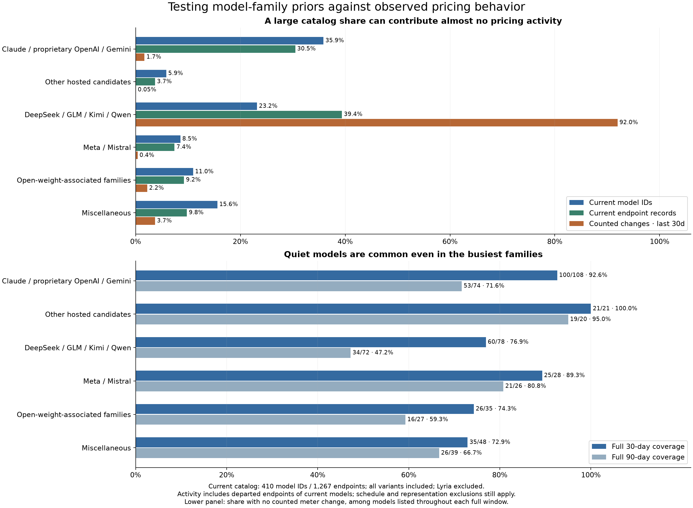
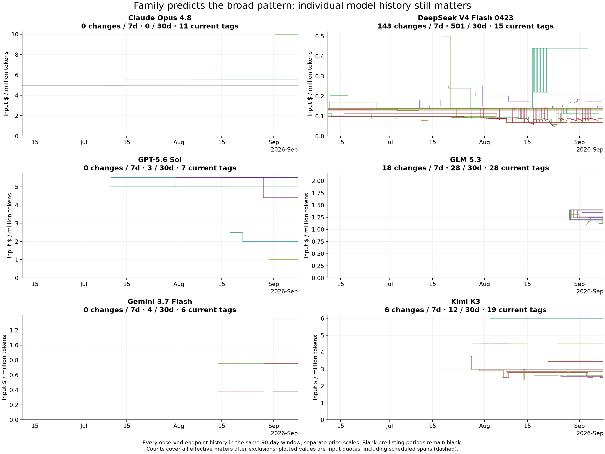

# Do model families predict whether a pricing chart is useful?

**The major-lab hypothesis is strongly supported. The broader finding is that quiet histories are
common throughout the catalog, so family alone is too coarse to decide which models get a chart.**
This study tags all 410 currently listed model IDs and all 1,267 current endpoints at the September 8
export clock, using the existing unmetered, schedule and reporting rules.

## How much of the current catalog belongs to the three major labs?

| Family                                | Current model IDs | Share of models | Current endpoints | Share of endpoints |
| ------------------------------------- | ----------------: | --------------: | ----------------: | -----------------: |
| Anthropic Claude                      |                27 |            6.6% |               105 |               8.3% |
| OpenAI proprietary, excluding GPT-OSS |                88 |           21.5% |               178 |              14.0% |
| Google Gemini, excluding Gemma        |                32 |            7.8% |               103 |               8.1% |
| **Combined**                          |           **147** |       **35.9%** |           **386** |          **30.5%** |

OpenAI includes the o-series and its text-capable audio/image IDs as well as GPT. All explicitly
listed variants count as separate model IDs, matching the catalog. Lyria remains excluded for the
song/lyrics modality issue. These are current listings, not the UI's grace period for recently
unlisted models, and these are catalog shares, not traffic or user-interest shares.

Variants matter to the model-count headline: 54 of the 147 major-lab IDs are batch variants. Among
only `variant: standard` models, the three labs account for **93/320 model IDs (29.1%)** and
**332/1,173 endpoints (28.3%)**. We do not attempt to collapse service tiers encoded differently in
model IDs, variant fields or provider tags.

The provider metadata supports the described serving structure. Claude's 105 endpoints are Anthropic
25, Amazon Bedrock 26, Google 31, Azure fourteen and Claude Platform on AWS nine. OpenAI's 178 are
OpenAI 114, Azure 59 and Amazon Bedrock five. Gemini's 103 are Google 57 and Google AI Studio 46.
These organization labels establish the observed providers; they do not independently prove a
commercial agreement or whether a particular price difference is a flex/priority tier.

## Comparing family tags with actual activity



Activity below counts all historical endpoints of **currently listed models**, including providers
that departed within the window. Its denominator is 2,128 recent changes, rather than the broader
2,135 in the earlier activity topic; the seven additional changes belong to models no longer listed.

| Cohort                               | Models | Endpoints | Changes / 30d | Share of changes | Models with no change / 30d |
| ------------------------------------ | -----: | --------: | ------------: | ---------------: | --------------------------: |
| Claude / proprietary OpenAI / Gemini |    147 |       386 |            36 |             1.7% |                     135/147 |
| Other hosted candidates              |     24 |        47 |             1 |            0.05% |                       23/24 |
| DeepSeek / GLM / Kimi / Qwen         |     95 |       499 |         1,957 |            92.0% |                       69/95 |
| Meta / Mistral                       |     35 |        94 |             8 |             0.4% |                       30/35 |
| Open-weight-associated families      |     45 |       117 |            47 |             2.2% |                       35/45 |
| Miscellaneous                        |     64 |       124 |            79 |             3.7% |                       50/64 |

The three major labs occupy 35.9% of model IDs but generate 1.7% of changes. Conversely, the four
named competitive families occupy 23.2% of model IDs and generate 92.0%. DeepSeek alone contributes
1,260, GLM 476, Kimi 159 and Qwen 62. The disparity persists over 90 days: those four families produce
3,556/4,049 changes (87.8%), versus 145/4,049 (3.6%) for the major labs.

There is no evidence that every Chinese-family chart deserves prominent treatment: **69 of those
95 model IDs have no counted change in 30 days**, including 44 of 53 Qwen IDs. The activity is concentrated
in individual models. Meta/Mistral are quiet in this snapshot—only eight recent changes—not a
numerical midpoint between the major labs and the busiest DeepSeek/GLM models.

### Other hosted candidates

The candidate extension is explicit and independent of the observed activity: xAI, Amazon Nova,
Perplexity, Writer, Inception, Morph and Relace. Together they have 24 model IDs and 47 endpoints,
with one recent change (Inception Mercury 2.5). Adding them to the major labs gives **171 models
(41.7%) and 433 endpoints (34.2%)**, but only 37 recent changes (1.7%).

This is a hosted-offering comparison, not a declaration that all underlying models or weights are
proprietary. Perplexity's catalog descriptions themselves mention underlying models. Similarly,
Cohere, Thinking Machines, Poolside and Reka are not put in the proprietary bucket merely because
they are Western labs: the catalog contains open-weight descriptions or weight references for them.

## Are they quiet only because they are new?

No. Among major-lab models listed continuously throughout the full 30-day window, **100/108 (92.6%)
have no counted meter change**. Among standard variants with full coverage, it is 81/88 (92.0%).
None of the 93 currently listed standard major-lab model IDs changes in the last seven days.

The longer window is less uniformly flat. Of 74 major-lab models covering the entire 90-day window,
57 (77.0%) have no input-price change and 53 (71.6%) have no change to any meter. Small-price-window
claims must not be silently generalized to a year of history.

Some of that distinction is pricing-schema richness rather than input/output movement: **60 of the
145 major-lab changes over 90 days concern only `input_cache_write_1h`**. A count across every meter
can overstate how much changes in the primary input-price chart.

## The exceptions are real enough to keep history accessible

All 36 recent major-lab changes were inspected. Claude contributes zero. OpenAI contributes 25,
concentrated in GPT-5.6 Luna/Terra/Sol and their pro/batch model IDs. Gemini contributes eleven,
concentrated in 3.6/3.7 Flash and batch IDs. There are 28 input-price changes and eight other-meter
changes; the full event CSV preserves the details.

Examples:

- GPT-5.6 Sol on OpenAI moves from `0.000005` to `0.0000025` on August 17 and `0.000002` on August 21.
- GPT-5.6 Luna on Azure moves from `0.000001` to `0.0000002` on August 10.
- Gemini 3.6 Flash on Google AI Studio halves from `0.0000015` to `0.00000075` on August 13.
- July 13 has a coordinated input-price batch affecting Claude through Google/Bedrock and OpenAI
  models through Azure. That is inside the 90-day comparison but outside the recent 30-day window.

These are observed rates, not an inferred explanation of discounts, tiers or corrections. They
illustrate why rare events can still matter. The data supports “usually stable,” not “never worth
inspecting.” Nor does it support assuming every hyperscaler difference is just a few cents.

At the current snapshot, 116/147 major-lab IDs have only one or two distinct metered input prices.
Among standard variants this is 62/93. Some still have several parallel price levels: Opus 4.8 has
three across eleven tags (`0.000005`, `0.0000055`, `0.00001`). A static price difference is distinct
from competition through repeated changes; its service-tier cause is not inferred from tag text.

## How much of the catalog has a genuinely simple recent input-price history?

Across all current models:

- 342/410 (83.4%) have no counted change to any meter in 30 days.
- 345/410 (84.1%) have no input-price change in 30 days.
- Restricting to models with complete 30-day listing coverage still leaves 270/318 (84.9%) with no
  input-price change. Newness is not the main explanation.
- **213/410 (52.0%) meet a conservative simplicity criterion:** full 30-day coverage, no counted
  input-price change, no scheduled span, and only one or two metered input-price levels across
  **all observed endpoints in the whole window**, including departed providers.
- Extending that criterion to 90 days gives 144/410 (35.1%). Young models and entirely unmetered
  histories are excluded from these simplicity counts rather than called boring by default.

Only eighty of the 213 simple 30-day histories belong to the three major labs; **133 are elsewhere**.
The dataset cannot measure subjective interest, but it can establish how little changing price
information a conventional line chart has to show. This is a stronger basis for the app decision
than treating openness, geography or author as a sufficient rule.

## Have the latest GLM and Kimi models stabilized?



| Model          | Observed age, days | Current tags | Changes / 7d | Changes / 30d |
| -------------- | -----------------: | -----------: | -----------: | ------------: |
| GLM 5.2        |                 84 |           31 |           65 |           344 |
| GLM 5.3        |                 21 |           28 |           18 |            28 |
| GLM 5.3 Flash  |                 13 |           23 |            6 |            22 |
| Kimi K2.6      |                141 |           20 |           29 |           138 |
| Kimi K3        |                 54 |           19 |            6 |            12 |
| Kimi K2.7 Code |                 88 |           15 |            2 |             7 |

The newer examples are quieter than the older battlegrounds, particularly Kimi. But GLM 5.3 has
18 of its 28 observations in the most recent week; its short total history cannot establish a
settled regime. Kimi K3 has twelve 30-day changes, six in the last week. Both retain many distinct
price levels—twelve for GLM 5.3 and nine for Kimi K3—so low movement does not mean providers all quote
the same price. Nothing here identifies a mechanism enforcing or coordinating stability.

## Implication for the app

The evidence supports making **current price comparison the compact default for quiet models**,
with history available on demand, rather than giving every model the same large historical chart.
Active models can warrant a prominent timeline with all providers and user-controlled slicing.
This is a hypothesis for the next prototype, not an implemented rule or an argument to remove
history from major labs.

Use family as context; use the model's actual history to choose emphasis. The decision needs to
consider time-window coverage, observed movement, price-level diversity and schedule presence.
That can happen internally without adding a taxonomy dashboard or more controls for users. Model
counts also do not tell us what share of actual user attention these two experiences will receive.

## Tags, evidence and reproduction

The six cohorts are mutually exclusive, assigned before inspecting changes. `families.py` contains
the explicit author/family rules; `model_family_activity.csv` contains every current model assignment,
variant, rationale and catalog weight-reference evidence. GPT-OSS and Gemma are explicit exceptions;
Meta and Mistral remain mixed; the four Chinese focus families are not all asserted to be open-weight.
The open-weight-associated cohort includes GPT-OSS, Gemma, Nvidia, Microsoft, IBM, Cohere, Thinking
Machines, Poolside and Reka. “Description mentions open-weight/source” and `hf_slug` are inspection
aids, not a per-model license verification. No family is classified using its measured price activity.

Counts retain explicit model IDs, including variants. Endpoint counts use internal UUIDs only as
research keys; they do not create new user choices. Complete model-window coverage is the union of
all its endpoint listing intervals. Activity includes expired endpoints of current models; current
endpoint quiet counts use only endpoints still listed. All zero/absent, schedule and reviewed
reporting exclusions from [methods](methods.md) apply unchanged.

```sh
python3 -B notes/pricing-history/research-2026-09-09/families.py
MPLCONFIGDIR=/private/tmp/orca-pricing-matplotlib /private/tmp/orca-pricing-research-venv/bin/python notes/pricing-history/research-2026-09-09/plot_families.py
python3 -B notes/pricing-history/research-2026-09-09/verify.py
bun run fix
```

Sources: [model tags and activity](data/model_family_activity.csv), [current tagged endpoints](data/current_endpoint_families.csv),
[cohort aggregates](data/cohort_activity.csv), [family aggregates](data/family_activity.csv),
[change distributions](data/family_change_distribution.csv), [major-lab event evidence](data/major_lab_change_events.csv),
[major-lab provider counts](data/major_lab_provider_counts.csv), [machine-readable summary](family_summary.json).
