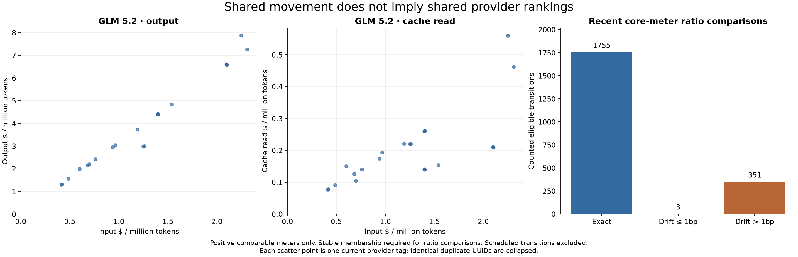

# Meter ratios and provider comparisons

**Most comparable recent transitions preserve core-meter ratios, but the ratio differs by provider.**
That supports questioning a primary meter selector without treating all prices as interchangeable.

## Co-movement within an endpoint

After schedule and unmetered normalization, 2,109 recent counted transitions are eligible for a
core-meter ratio comparison. Eligibility requires unchanged membership among prompt, completion and
cache read, with a positive comparable pair before and after.

- 1,755 preserve ratios exactly: **83.2%**.
- Three additional transitions preserve them within one basis point.
- 351 drift by more than one basis point: **16.6%**.

| Model                  | Eligible transitions |             Within 1bp |
| ---------------------- | -------------------: | ---------------------: |
| GLM 5.2                |                  343 |            329 (95.9%) |
| DeepSeek V4 Flash 0423 |                  501 |            469 (93.6%) |
| DeepSeek V4 Pro 0423   |                  427 |            421 (98.6%) |
| MiniMax M3             |                    5 |                      4 |
| Claude Opus 4.8        |                    0 | No temporal comparison |

Removing scheduled band movements reduces the aggregate proportionality rate; those repetitive
movements must not supply evidence about independent repricing decisions. The discount battlers
still show strong proportionality. Mancer 2 supplies 89 of the >1bp exceptions, Decart 35,
OpenInference 26 and Inceptron 26. Exceptions cluster too; the aggregate is not a universal rule.

This comparison says nothing about whether a meter is supported when unmetered, and it does not
claim ratios never change between observed scans. Initial listing and first publication of a meter
are excluded from the co-movement denominator.

## Comparison across providers is a different question

GLM 5.2 has 31 current tags after identical duplicate UUIDs are collapsed. Of 393 provider pairs with
unequal prompt prices, five reverse ordering on completion, while **88 reverse ordering on cache
read (22.4%)**. An input-price ordering is therefore a useful overview but not a complete cost ranking.

Opus 4.8's eleven tags show no inversions in either comparison; MiniMax M3 has one cache inversion.
The fact that a model's prices move in lockstep does not establish a single shared ratio across all
its providers.

Of 930 current metered cache-read endpoints, 400 have a cache/input ratio of 0.1 and 124 have 0.2.
Twenty-two have 1.0. Every one of the 105 current one-hour cache-write meters is twice prompt.
Those are scoped observed patterns, not formulas to hardcode into the product.

## Design implication to test

A single primary price trajectory may communicate most movement without asking users to toggle
three nearly redundant charts. But a user's choice of provider can depend on a different ratio.
The research supports separating **understanding movement** from **comparing a workload's costs**;
it does not yet choose a composite price, workload mix or hidden default weighting.

Sources: [events and exact ratio drift](data/events.csv), [current ratios](data/current_ratios.csv),
[ranking inversions](data/cross_meter_rankings.csv), [methods](methods.md).
