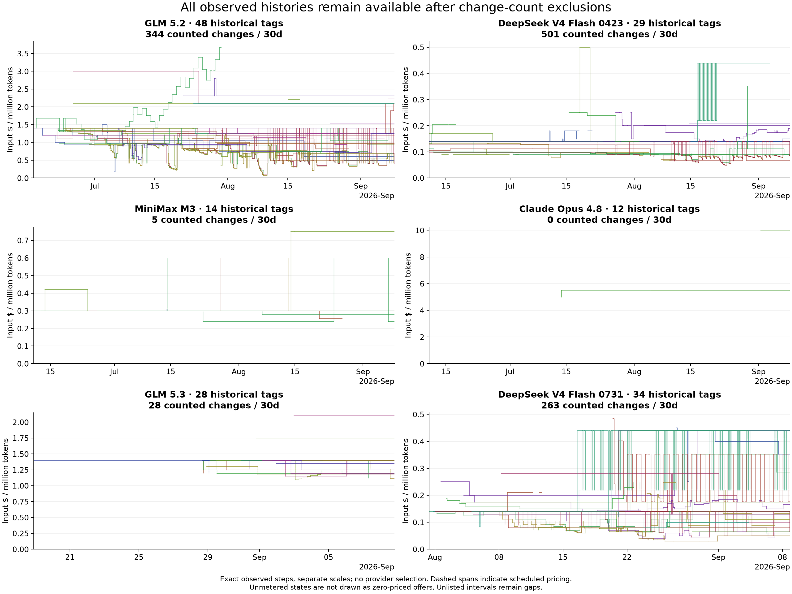
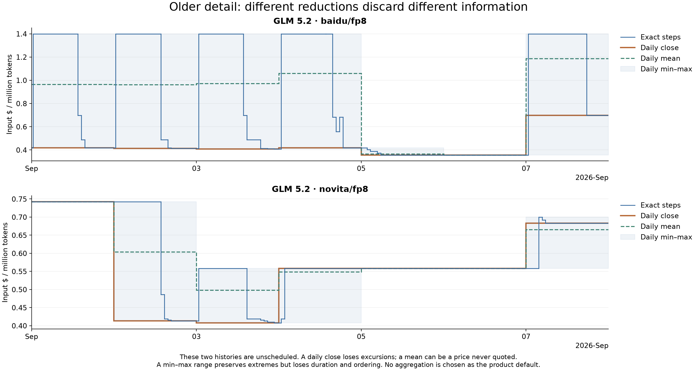

# Timeline detail and the initial overview

**Keep the full observed story available, then let users choose what to inspect.** The research
supports controlling temporal detail; it does not support automatically picking a few providers to
represent the market.

These rebuilt diagnostic charts carry prices forward as steps, preserve unlisted gaps, and display
all observed endpoint histories in each window. Scheduled states remain visible with dashed spans,
even though movement involving those states is excluded from change counts. No schedule is parsed.
Unmetered is not drawn as a zero-priced offer; price fields alone cannot identify free offerings.

GLM 5.2 and GLM 5.3 illustrate why provider count and temporal density should not be conflated.
Both have broad current catalogs, but their histories have very different amounts of movement. Opus
and MiniMax do not need artificial detail to become interesting; their stability is itself the story.

## What is lost when the timeline becomes coarser?

The recent window contains **704 complete unscheduled endpoint-days with intraday prompt movement**.
Of those, 121 (17.2%) end at the same price they started, and 283 (40.2%) contain an extreme outside
the range spanned by their opening and closing prices. This denominator excludes static days,
scheduled spans, partial days, listing gaps and unmetered prompt states.

Baidu's GLM 5.2 history has repeated excursions; Novita's has a different pattern. Neither carries
schedule overrides in the plotted interval. A daily close loses excursions; a daily mean can show a
price that was never quoted; a daily min–max range preserves extremes but loses their ordering and
duration. These are concrete costs of different reductions, not a reason to preserve hourly detail
forever or to claim one reduction is universally faithful.

Dean's product premise is that the value of hourly detail falls sharply with age. The data describes
what will be discarded; it cannot establish users' preferred retention horizon. A useful next
prototype would let a person change the time window and detail level while keeping the same provider
scope, then check whether they can still answer their actual question.

## Keep the user stories narrow

The evidence supports investigating three distinct tasks:

1. **Understand the market around this model:** its broad history, spread and activity, including chaos.
2. **Investigate a provider or period:** user-directed slicing with exact observations when useful.
3. **Return to comparison:** inspect history without losing the data-grid filters, selection and scroll.

An overlay integrated with the grid remains a sensible product direction. These research artifacts
are deliberately isolated from that implementation. Monitor events, historical quote trajectories
and economic pricing changes are related but not identical; [reporting](reporting.md) shows why one
unqualified event count should not stand in for all three.

Sources: [segments](data/segments.csv), [daily-resolution diagnostics](data/daily_resolution.csv),
[model activity](data/models.csv), [methods](methods.md).
